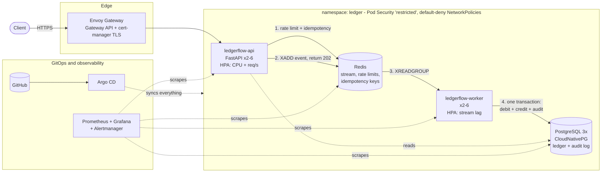

# ledgerflow

[](https://github.com/geve-ops/ledgerflow/actions/workflows/ci.yaml)

An event-driven, double-entry **payment ledger** running on Kubernetes, built to show how a
fintech backend is operated: idempotent ingestion, an auditable ledger, zero-trust networking,
GitOps delivery, and autoscaling driven by real metrics. Everything runs locally in a 3-node
[Kind](https://kind.sigs.k8s.io/) cluster and rebuilds from this repository with one script.

## Architecture



**Request flow.** `POST /v1/transactions` authenticates the caller, applies a per-client rate
limit and an idempotency check (both in Redis), appends the event to a Redis Stream and returns
`202 Accepted` with a transaction id. A worker consumes the event and posts it to Postgres
inside one database transaction: a debit row, a credit row, updated balances and an audit
entry. A failed posting stays pending and is redelivered; after five attempts it moves to a
dead-letter stream. Callers read the result from `GET /v1/transactions/{id}`.

## Measured results

All numbers come from a single laptop (3 Kind nodes sharing one machine), so read them as
relative behaviour, not absolute capacity. Reproduce with the scripts in `scripts/`.

| Test | Result |
|---|---|
| **Load: 300 req/s for 3 min** (91k requests, via the TLS gateway) | 0% errors, p99 **17 ms**, avg 9.6 ms |
| **Ledger integrity after load** | 82,971 accepted = 82,971 posted, 0 dead-lettered, no duplicate idempotency keys, debits = credits |
| **Worker bottleneck found and fixed** | Peak posting rate 144 -> **270 tx/s**; peak backlog 41,618 -> **9,645** events; drain time after load: minutes -> ~**40 s** |
| **Autoscaling** | API 2 -> 6 pods in ~70 s on request rate; workers 2 -> 6 on queue depth |
| **Postgres primary killed under 40 req/s** | New primary after **25 s**, 3/3 healthy after **50 s**; every payment still accepted; **0 lost** (173,147 = 173,147) |
| **Rolling update via Git, under 40 req/s** | Rolled out in **33 s**, **0 failed requests** out of 6,602 |
| **Node drain under 40 req/s** (2 Postgres replicas + API pods) | Second replica protected by its PodDisruptionBudget; every payment accepted, **0 lost** (187,904 = 187,904); healthy again 88 s after the node returned |

Details, methods and caveats for every experiment: [docs/chaos.md](docs/chaos.md).

The second load run is the interesting one. The first showed the API easily absorbing 330 req/s
while a single-threaded worker fell behind (the stream is a buffer, so nothing was lost, but the
backlog kept growing and the lag alert would have fired). I made the worker post concurrently,
sized its database pool against Postgres' connection limit, and added an HPA that scales on
stream lag. Same load, 4x smaller backlog.

## What is demonstrated

| Area | Implementation |
|---|---|
| Routing and TLS | Kubernetes **Gateway API** (Envoy Gateway), HTTP -> HTTPS redirect, certificates issued by **cert-manager**; only `/v1/*` and `/healthz` are exposed |
| Zero-trust networking | Default-deny **NetworkPolicies** enforced by **Cilium**; one policy per allowed flow; a rogue pod in the namespace reaches nothing (tested) |
| Pod security | `restricted` Pod Security Standard enforced on the namespace; non-root, read-only filesystem, all capabilities dropped, seccomp `RuntimeDefault` |
| Secrets | **Sealed Secrets**: encrypted values live in Git; the key is backed up out of band |
| RBAC | One ServiceAccount per workload, no token mounted, no Role bound (the apps never call the Kubernetes API) |
| State | **CloudNativePG** (1 primary + 2 replicas, automatic failover) with PersistentVolumeClaims; Redis StatefulSet with AOF persistence |
| Resilience | Startup/readiness/liveness probes, requests and limits, `maxUnavailable: 0` rolling updates, PodDisruptionBudgets, topology spread, graceful shutdown |
| Autoscaling | **HPA** on CPU + custom `requests/s` (prometheus-adapter) for the API; HPA on **external queue-depth metric** for the worker |
| Delivery | **Helm** chart, **Argo CD** app-of-apps with sync waves and a custom CNPG health check; GitHub Actions builds, scans (Trivy) and pushes to GHCR, then commits the new image tag |
| Observability | **Prometheus**, **Grafana** (dashboard as code), **Alertmanager** rules for error rate, p99 latency, queue lag, dead letters and replication lag |

## Repository layout

```
services/app/      FastAPI API + worker (one image, two entrypoints), tests, Dockerfile
charts/ledgerflow/ Helm chart: deployments, HPAs, PDBs, migration hook
gitops/bootstrap/  Argo CD project + root app-of-apps
gitops/apps/       one Argo CD Application per component, ordered with sync waves
gitops/platform/   Helm values for operators and the monitoring stack
gitops/{data,edge,network-policies,observability}/   plain manifests
load-tests/        k6 script and in-cluster Job
scripts/           bootstrap, load test, chaos tests, dashboard generator
```

## Run it

Prerequisites: Docker Desktop (WSL2 backend), `kind`, `kubectl`, `helm`, `git`. About 8 GB of RAM
for Docker.

```powershell
./scripts/bootstrap.ps1          # Kind -> Cilium -> Argo CD -> everything else from Git
kubectl -n argocd get applications -w
./scripts/edge-forward.ps1       # https://ledgerflow.localtest.me:9443
```

A fresh bootstrap takes roughly 15 to 20 minutes, mostly image pulls and the first database
initialisation. Argo CD reports a few apps `Degraded` while the platform comes up in order;
retries resolve this without intervention.

```powershell
./scripts/loadtest.ps1 -PeakRps 300             # ramping load, in-cluster k6
./scripts/chaos-failover.ps1                    # kill the Postgres primary under load
./scripts/chaos-rollout.ps1                     # change config through Git under load
./scripts/chaos-drain.ps1                       # drain a node under load
```

Grafana: `kubectl -n monitoring port-forward svc/kube-prometheus-stack-grafana 3000:80`,
dashboard **Ledgerflow: transactions, latency and scaling**.

## Design decisions

- **Accept first, post later.** The API only needs Redis to take a payment, so a database
  failover does not reject traffic (verified above). The cost is that callers see `pending`
  before `posted`.
- **Idempotency keys are required**, scoped per client and fingerprinted against the request
  body, so a retry returns the original transaction and a key reused with a different body is
  a `409`. The posting itself is also idempotent (`INSERT ... ON CONFLICT DO NOTHING`), which
  makes redelivery safe.
- **Concurrent postings cannot deadlock**: accounts are locked in sorted order.
- **Append-only ledger and audit log**, enforced by database triggers, not application code.
- **A label-free request counter drives the HPA.** A labelled counter only appears after a pod's
  first request, so idle pods looked like "metric missing" and the HPA refused to scale down.
  This was found in testing and has a regression test.

## Known limitations

- **Redis is a single instance.** A node loss that takes its volume would pause ingestion until
  it returns. Production would use Redis Sentinel/Cluster or a managed service.
- **Volumes are node-local** (Kind's default storage), so a Postgres replica cannot move to
  another node while its node is down. Real network-attached storage removes this.
- **No database backups** are configured (CloudNativePG supports object-store backups; it needs a bucket).
- The TLS certificate comes from a **local CA**; swap the issuer for ACME in a real environment.
- Rate limiting is a fixed window per client, which allows short bursts at window edges.
- If an API pod dies between claiming an idempotency key and enqueuing the event, that key
  stays claimed until its TTL expires. A normal enqueue failure releases it.
- The Kind cluster runs on one machine, so these are behaviour tests, not capacity numbers.
