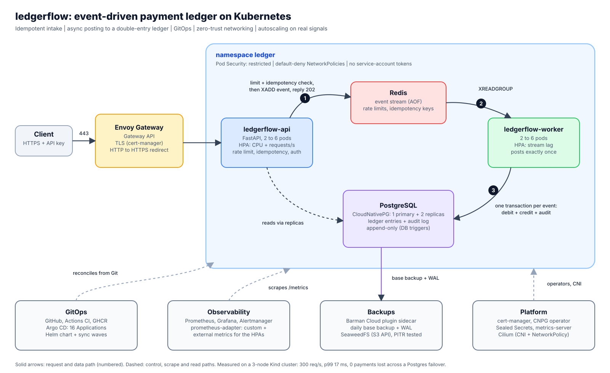
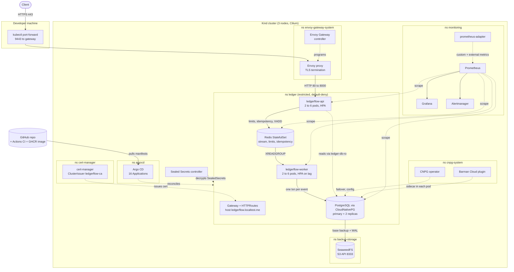
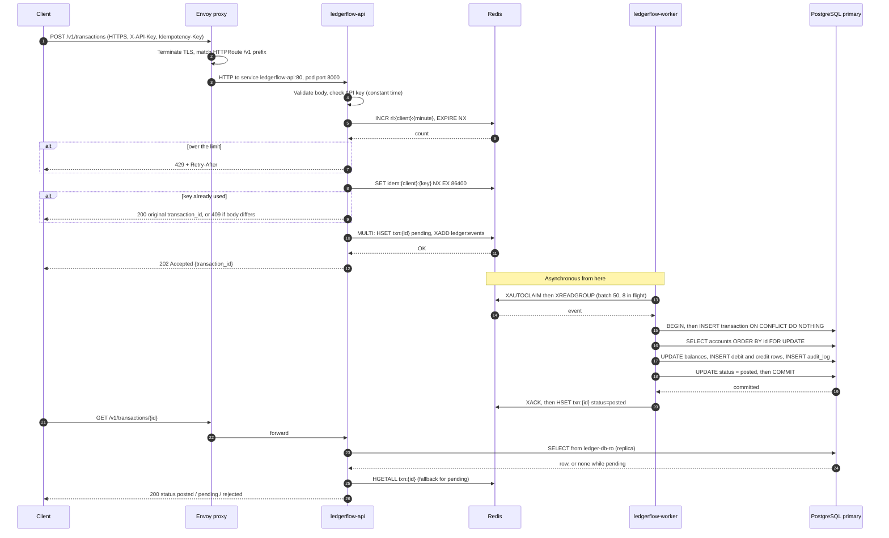
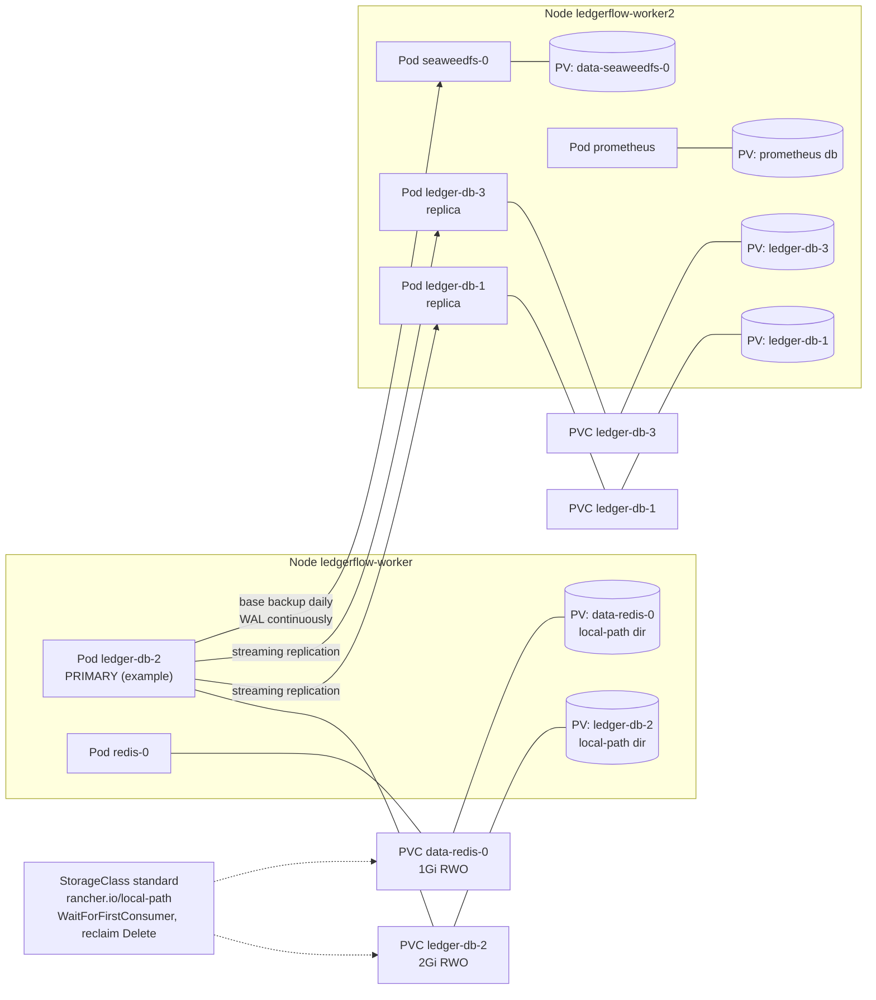
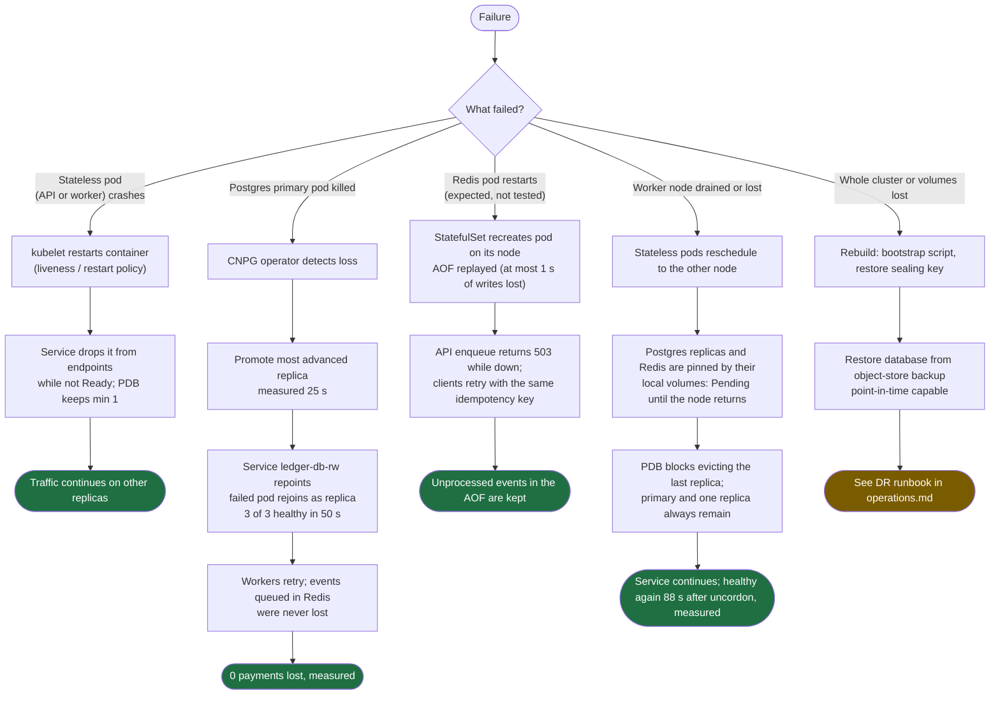

# Architecture

This document describes what is deployed, how traffic and data move through it, and where the
design is deliberately simple. Statements marked **(measured)** come from the tests in
[chaos.md](chaos.md) and [backups.md](backups.md). Anything the system does *not* have is
called out explicitly in [Gaps](#gaps-and-honest-limits) rather than implied.

Related: [security.md](security.md) | [observability.md](observability.md) |
[operations.md](operations.md) | [reference/manifests.md](reference/manifests.md) (every manifest)

---

## 1. Executive summary and system overview

**Purpose.** `ledgerflow` is a payment ledger service. Clients submit payment events over HTTPS;
the system accepts them durably, applies them exactly once to a double-entry ledger in PostgreSQL,
and keeps an immutable audit trail. It exists to demonstrate how such a backend is *operated* on
Kubernetes: idempotent ingestion, async processing, failure recovery, zero-trust networking,
GitOps delivery, autoscaling on real signals, and verified backup and restore.

**Technical value.**

| Property | How it is achieved |
|---|---|
| A retry never double-charges | Required `Idempotency-Key`, fingerprinted against the body; posting is `INSERT ... ON CONFLICT DO NOTHING`; `UNIQUE (client_id, idempotency_key)` in Postgres |
| A database outage does not reject traffic | API only needs Redis to accept; the worker posts later **(measured: 0 lost across a primary kill)** |
| The ledger cannot be silently altered | Database triggers forbid `UPDATE`/`DELETE` on `ledger_entries` and `audit_log` |
| It scales on the right signals | API on CPU + requests/s; worker on queue depth |
| It is reproducible | Everything after Cilium and Argo CD is created from Git |

**Target environment.** A local 3-node [Kind](https://kind.sigs.k8s.io/) cluster (1 control plane,
2 workers; Kubernetes v1.37.0) on Docker Desktop/WSL2. The manifests use no cloud-specific
resources, so the same Helm chart and Argo CD apps apply to a managed cluster once the storage
class, object-store endpoint and certificate issuer are changed.

### 1.1 Core workloads

| Workload | Kind | Replicas | Namespace | Role |
|---|---|---|---|---|
| `ledgerflow-api` | Deployment | 2 (HPA 2-6) | `ledger` | HTTP API: auth, rate limit, idempotency, enqueue, reads |
| `ledgerflow-worker` | Deployment | 2 (HPA 2-6) | `ledger` | Consumes the event stream, posts to the ledger |
| `ledgerflow-migrate` | Job (Helm pre-install/upgrade hook; Argo PreSync) | per release | `ledger` | Applies the idempotent schema |
| `ledger-db` | CloudNativePG `Cluster` | 3 (1 primary + 2 replicas) | `ledger` | Ledger, accounts, audit log |
| `redis` | StatefulSet | 1 (+ exporter sidecar) | `ledger` | Event stream, rate-limit counters, idempotency keys, status cache |

### 1.2 Supporting components

| Component | Kind | Namespace | Role |
|---|---|---|---|
| Envoy Gateway controller + proxy | Deployments | `envoy-gateway-system` | Gateway API implementation; the proxy is the data plane |
| cert-manager (controller, cainjector, webhook) | Deployments | `cert-manager` | Issues the Gateway's TLS certificate from a local CA |
| CloudNativePG operator | Deployment | `cnpg-system` | Runs and fails over Postgres |
| Barman Cloud plugin | Deployment | `cnpg-system` | Backups and WAL archiving (sidecar in each Postgres pod) |
| Sealed Secrets controller | Deployment | `sealed-secrets` | Decrypts committed secrets |
| Argo CD (server, repo-server, application-controller, applicationset, redis) | Deployments / StatefulSet | `argocd` | GitOps reconciliation (16 Applications) |
| Prometheus, Alertmanager | StatefulSets | `monitoring` | Metrics and alerts |
| Grafana, kube-state-metrics, Prometheus Operator, prometheus-adapter | Deployments | `monitoring` | Dashboards, object metrics, scrape config, custom/external metrics for HPAs |
| SeaweedFS + bucket Job | StatefulSet + Job | `backup-storage` | S3-compatible backup target |
| Cilium (+ Envoy, operator, Hubble) | DaemonSets / Deployments | `kube-system` | CNI and NetworkPolicy enforcement |
| metrics-server, CoreDNS, kube-proxy | Deployments / DaemonSet | `kube-system` | Resource metrics, DNS, service routing |
| local-path-provisioner | Deployment | `local-path-storage` | Dynamic local volumes |

---

## 2. Component breakdown

### 2.1 Application (`services/app`, one image, two entrypoints)

**API** (`uvicorn ledgerflow.api.main:app`, port 8000)

| Endpoint | Auth | Behaviour |
|---|---|---|
| `POST /v1/accounts` | key + rate limit | Creates an account (writes to the primary) and an audit row |
| `GET /v1/accounts/{id}` | key + rate limit | Balance from the read replicas (`ledger-db-ro`) |
| `POST /v1/transactions` | key + rate limit + `Idempotency-Key` | Enqueues; returns `202` + `transaction_id`; replays return `200` |
| `GET /v1/transactions/{id}` | key + rate limit | Postgres row if posted/rejected, else the Redis status (`pending`) |
| `GET /v1/ledger/integrity` | key + rate limit | Debits = credits and balances sum to zero |
| `/healthz`, `/readyz`, `/metrics` | none | Probes and Prometheus; **not exposed at the gateway** |

Request handling order for `POST /v1/transactions`:

1. Validate the body (amount `1..10^12` minor units, ISO-style currency, distinct accounts).
2. Constant-time API-key comparison, mapping the key to a client id.
3. Fixed-window rate limit: `INCR rl:{client}:{minute}` and `EXPIRE ... NX 70` in one `MULTI`.
4. Idempotency: `SET idem:{client}:{key} "{txn_id}|{sha256(body)}" NX EX 86400`. A second request
   with the same key and body returns the original id; a different body returns `409`.
5. In one `MULTI`: `HSET txn:{id} status=pending`, `EXPIRE`, `XADD ledger:events {data: json}`.
6. If the enqueue fails, the idempotency key is deleted (so the client can retry) and `503` returned.

**Worker** (`python -m ledgerflow.worker.main`, metrics/health on 9100)

- Reads with `XAUTOCLAIM` (reclaim entries idle > 30 s) then `XREADGROUP` (batch 50), and posts up
  to 8 events concurrently.
- Posting is one Postgres transaction: insert the transaction row (conflict = already processed),
  lock both accounts in sorted order (`FOR UPDATE`, deadlock-free), validate (accounts exist,
  currency matches, funds sufficient unless `allow_negative`), update balances, insert a debit and
  a credit row, mark `posted`, write the audit row.
- Business rejections (`unknown_account`, `currency_mismatch`, `insufficient_funds`) are recorded
  as `rejected`, not retried. Technical failures stay pending and are redelivered; after 5
  deliveries (or a malformed event) the event moves to the dead-letter stream `ledger:events:dlq`.

**Schema** (`schema.sql`, applied by the migration Job under an advisory lock): `accounts`,
`transactions` (unique `(client_id, idempotency_key)`), `ledger_entries`, `audit_log`; append-only
triggers on the last two.

### 2.2 Kubernetes resources in the `ledger` namespace

| Resource | Names | Notes |
|---|---|---|
| Deployments | `ledgerflow-api`, `ledgerflow-worker` | `RollingUpdate`, `maxUnavailable: 0`, `maxSurge: 1`; topology spread over nodes; non-root, read-only root filesystem |
| StatefulSet | `redis` | `redis:7.4-alpine` + `redis_exporter` sidecar; AOF (`appendfsync everysec`), `maxmemory 256mb`, `maxmemory-policy noeviction` (writes fail rather than evict) |
| `Cluster` (CRD) | `ledger-db` | PostgreSQL 18.6 image, 3 instances, plugin `barman-cloud.cloudnative-pg.io` |
| `ScheduledBackup`, `Backup`, `ObjectStore` (CRDs) | `ledger-daily`, `manual-first`, `ledger-store` | Daily 02:00 base backup; WAL archiving; 7-day retention |
| Services | `ledgerflow-api` (80), `redis` (headless, 6379), `ledger-db-rw`, `-ro`, `-r` (5432) | `-rw` primary, `-ro` replicas only, `-r` any instance |
| Gateway API | `Gateway/ledgerflow`, `HTTPRoute/ledgerflow-api`, `HTTPRoute/ledgerflow-http-redirect` | Listeners 80 (redirect) and 443 (TLS); hostname `ledgerflow.localtest.me` |
| `Certificate` | `ledgerflow-tls` | Created by cert-manager from the Gateway annotation (`ledgerflow-ca`) |
| ConfigMaps | `redis-config` | Others come from Helm values via env vars |
| Secrets | `ledger-secrets` (Redis password, API keys), `ledger-db-app` (generated by CNPG), `s3-credentials`, certificates | See [security.md](security.md#3-secrets) |
| PodDisruptionBudgets | `ledgerflow-api`, `ledgerflow-worker` (minAvailable 1), `ledger-db`, `ledger-db-primary` (created by CNPG) | |
| HPAs | `ledgerflow-api`, `ledgerflow-worker` | See [operations.md](operations.md#64-horizontal-pod-autoscalers-implemented) |
| NetworkPolicies | 7 + 1 `CiliumNetworkPolicy` | See [security.md](security.md#1-network-isolation) |
| ServiceAccounts | `ledgerflow-api`, `-worker`, `-migrate`, `redis`, `ledger-db` (CNPG) | |

Custom resource definitions in use: Gateway API and Envoy Gateway, CloudNativePG (+ Barman Cloud
`ObjectStore`), cert-manager, Cilium, Sealed Secrets, Prometheus Operator, Argo CD.

### 2.3 Inter-service communication

| From | To | How | Encrypted? |
|---|---|---|---|
| Client | Envoy proxy | HTTPS (TLS terminated at the Gateway; HTTP -> HTTPS redirect) | Yes (TLS) |
| Envoy | `ledgerflow-api` | Service `ledgerflow-api:80` -> pod `8000`, plain HTTP | **No** |
| API / worker | Redis | `redis.ledger.svc.cluster.local:6379`, password auth | **No** (password only) |
| API / worker / migrate | Postgres | `ledger-db-rw` / `-ro` `:5432` | **Yes, TLS 1.3 (verified in `pg_stat_ssl`)**, but opportunistic: the URI has no `sslmode`, so libpq uses `prefer` and does not verify the server certificate |
| Postgres pods | Each other | streaming replication, instance status on 8000 | CNPG-managed certificates |
| Postgres pods | Object store | `seaweedfs.backup-storage.svc:8333`, plain HTTP | **No** |
| Prometheus | targets | HTTP scrape | No |

Discovery is plain Kubernetes DNS (`<service>.<namespace>.svc.cluster.local`, served by CoreDNS,
2 replicas). Cilium runs with `kube-proxy-replacement=false`, VXLAN tunnelling, and Hubble
enabled.

> **There is no service mesh and no in-cluster mutual TLS.** Cilium's transparent encryption
> (`enable-encryption`) and mutual authentication (`mesh-auth-enabled`) are **off**. Pod-to-pod
> traffic is isolated by NetworkPolicy, not encrypted. Enabling WireGuard transparent encryption
> in Cilium is the smallest step to encrypt it; a mesh would add per-workload identity.

### 2.4 Storage architecture

| Item | Value |
|---|---|
| StorageClass | `standard` (Kind default), provisioner `rancher.io/local-path` |
| Binding mode | `WaitForFirstConsumer` (the volume is created on the node where the pod is first scheduled) |
| Reclaim policy | **`Delete`** (deleting a PVC deletes the data) |
| Expansion | Not supported |
| Access mode | `ReadWriteOnce` everywhere |
| Node affinity | Every PersistentVolume is **pinned to one node** |

| PVC | Size | Owner | Holds |
|---|---|---|---|
| `ledger-db-1..3` | 2 Gi each | CNPG `Cluster` | PostgreSQL data + WAL |
| `data-redis-0` | 1 Gi | StatefulSet `volumeClaimTemplates` | AOF file |
| `prometheus-kps-prometheus-db-...-0` | 5 Gi | Prometheus Operator | TSDB (3-day retention) |
| `data-seaweedfs-0` | 5 Gi | StatefulSet | Backup objects |

Volume lifecycle: with `WaitForFirstConsumer` the PVC stays `Pending` until its pod schedules,
the provisioner then creates a directory on that node, and from then on the pod can only run on
that node. This is why a drained node can leave a Postgres replica `Pending` until the node
returns **(observed in the drain test)**. Network-attached storage removes the constraint.

Backup and restore: see [backups.md](backups.md). A daily base backup plus continuous WAL
archiving go to `s3://cnpg-backups/` (SeaweedFS), with 7-day retention. A point-in-time restore
into a fresh cluster reproduced the recorded state exactly **(measured)**. Redis is not backed up
(it holds the in-flight stream, not the ledger); AOF protects it across restarts.

---

## 3. Diagrams

The picture above is the one-page view ([SVG](diagrams/architecture.svg),
[PNG](diagrams/architecture.png), generated by `scripts/gen_architecture_svg.py`). The diagrams
below are Mermaid source, which GitHub renders; pre-rendered images of them are in
[diagrams/](diagrams/).

### 3.1 High-level end-to-end architecture

### 3.2 Request lifecycle

If the posting fails (for example during a database failover), the transaction rolls back, the
entry stays unacknowledged, and `XAUTOCLAIM` redelivers it after 30 s. After 5 deliveries it is
moved to `ledger:events:dlq` and acknowledged.

### 3.3 Data storage and persistence topology

Which node holds which volume is decided at first scheduling and then fixed. Placement above
reflects the state at the time of writing; after a failover the primary role moves between pods,
but each pod's volume stays on its node.

### 3.4 Failure recovery and high availability

A hard **node crash** (as opposed to a graceful drain) has not been tested. Kubernetes' default
behaviour is to mark the node `NotReady` and evict its pods after 300 s unless the tolerations
are tuned, which this project does not do.

---

## Gaps and honest limits

| Area | Status |
|---|---|
| Service mesh / mTLS between workloads | **Not implemented.** Isolation by NetworkPolicy only; no pod-to-pod encryption |
| Redis high availability | **Single instance.** A node loss pauses ingestion until the node returns |
| Volumes | Node-local; replicas cannot move while their node is down |
| Backup target | In-cluster SeaweedFS pod. Proves the mechanism; not a durable off-cluster copy |
| Hard node-crash recovery | Not tested (drain and pod-kill were) |
| Multi-zone / multi-cluster | Single cluster on one machine; numbers show behaviour, not capacity |
| TLS certificate | Local CA; replace the issuer with ACME for a public hostname |
