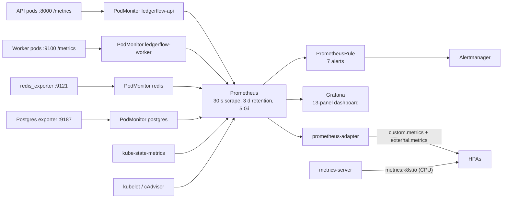

# Observability and reliability

What is measured, what alerts, how health is judged, and what is **not** in place. Related:
[architecture.md](architecture.md) | [operations.md](operations.md) |
[reference/manifests.md](reference/manifests.md#observability)

Legend: **Implemented** = deployed and verified. **Proposed** = not deployed; shown so the next
step is concrete.

---

## 1. Logging

### 1.1 Current state (implemented)

| Source | Format | Where it goes |
|---|---|---|
| API (uvicorn) | text access log (`INFO: <ip> - "GET /path" 200 OK`) | container stdout |
| Worker | text (`time level logger message`) | stdout |
| PostgreSQL (CloudNativePG) | **JSON** (`logging_pod`, `record{...}`) | stdout |
| Barman sidecar | JSON | sidecar stdout |
| Envoy, Argo CD, operators | component-native | stdout |
| Network flows | Cilium **Hubble** (relay + UI deployed) | in-memory ring buffer per node |

There is **no sidecar log collector and no log aggregation pipeline**. Logs live in the
container runtime and disappear with the pod (`kubectl logs` and `--previous` are the interface).
Kubernetes events are likewise not exported. For a local project this is a deliberate economy;
for anything shared it is the largest observability gap, because incidents are diagnosed after
the pod that explains them is gone.

Practical commands:

```bash
kubectl -n ledger logs deploy/ledgerflow-api --tail=100
kubectl -n ledger logs <pod> --previous                      # logs of the crashed container
kubectl -n ledger logs ledger-db-2 -c postgres --tail=50     # JSON
kubectl -n ledger logs ledger-db-2 -c plugin-barman-cloud    # WAL archiving / backups
kubectl -n ledger get events --sort-by=.lastTimestamp | tail -20
```

### 1.2 Application logging weaknesses

- The API logs every probe and scrape (`/metrics`, `/readyz`) at INFO, which is noise.
- No request id or correlation id ties an API log line to the worker's posting of the same
  transaction; the `transaction_id` is returned to the client but not logged by the API.
- Logs are text, not JSON, so they cannot be filtered by field without parsing.

### 1.3 Proposed aggregation (not deployed)

Grafana Loki with a node-level collector fits the existing Grafana and needs no sidecars:

```yaml
# gitops/apps/logging.yaml (proposal): two Argo CD Applications
#   loki  (grafana/loki, SingleBinary, filesystem storage, 3-day retention)
#   alloy (grafana/alloy, DaemonSet reading /var/log/pods, label-mapped to namespace/pod/container)
# Grafana datasource: Loki http://loki.monitoring.svc:3100
# Needed NetworkPolicy: none for ledger (collection happens on the node); Loki ingress from Grafana.
```

Pair it with structured JSON logging in the application and a request id propagated from the
`X-Request-ID` header into both the API and the worker event.

---

## 2. Metrics

### 2.1 Pipeline (implemented)



Verified targets (all `up`): `ledgerflow-api` 2/2, `ledgerflow-worker` 2/2, `postgres` 3/3,
`redis` 1/1, plus kubelet, API server, CoreDNS, kube-state-metrics, Alertmanager, Grafana and the
operator. Node-exporter is disabled (Kind has no meaningful host to scrape); the control-plane
components (etcd, scheduler, controller-manager) are not scraped.

### 2.2 Application metrics

| Metric | Type | Labels | Meaning |
|---|---|---|---|
| `ledger_api_requests_total` | counter | none | Requests served (probes and `/metrics` excluded). **Label-free on purpose**: it exists from process start, so idle pods report `0`. The HPA metric is built on it |
| `ledger_http_requests_total` | counter | method, route, status | Per-route request counts and status codes |
| `ledger_http_request_duration_seconds` | histogram | method, route | Latency (buckets 5 ms to 2.5 s) |
| `ledger_transactions_submitted_total` | counter | outcome (`accepted`, `replayed`, `enqueue_failed`) | Intake results |
| `ledger_rate_limited_total` | counter | client | 429s per client |
| `ledger_idempotent_replays_total` | counter | none | Replays served |
| `ledger_transactions_total` | counter | status (`posted`, `rejected`, `duplicate`, `error`, `dead_lettered`) | Worker outcomes |
| `ledger_posting_duration_seconds` | histogram | none | Time to post one event to Postgres |
| `ledger_stream_lag` | gauge | none | Events not yet delivered to the consumer group |
| `ledger_stream_pending` | gauge | none | Delivered but unacknowledged |

Exporters add `redis_*` (memory, clients, commands) and `cnpg_*` (replication lag, backends,
WAL, backup status). The Kubernetes side comes from kube-state-metrics and cAdvisor.

### 2.3 Dashboard (implemented)

`Ledgerflow: transactions, latency and scaling`, generated by `scripts/gen_dashboard.py` and
loaded from a ConfigMap by Grafana's sidecar (13 panels):

| Row | Panels |
|---|---|
| Traffic and correctness | Transactions posted/s; accepted by API/s (by outcome); 5xx error ratio; business rejections/s |
| Latency | API p50/p95/p99; ledger posting time p50/p99 |
| Pipeline and scaling | Event stream lag and pending; replicas (HPA); API requests/s per pod |
| Data layer | Rate-limited requests/s; idempotent replays/s; Postgres replication lag; Redis memory |

---

## 3. Alerts

### 3.1 Implemented rules (`gitops/observability/alerts.yaml`)

| Alert | Expression (summary) | For | Severity |
|---|---|---|---|
| `LedgerHighErrorRate` | 5xx ratio of all API requests > 2 % over 5 m | 5 m | critical |
| `LedgerHighLatencyP99` | p99 of `ledger_http_request_duration_seconds` > 0.5 s over 5 m | 5 m | warning |
| `LedgerStreamLagGrowing` | `max(ledger_stream_lag) > 100` | 5 m | warning |
| `LedgerDeadLetters` | any increase in `dead_lettered` over 10 m | immediate | critical |
| `LedgerWorkerDown` | no worker scrape target up | 3 m | critical |
| `PostgresReplicationLag` | `max(cnpg_pg_replication_lag) > 30` s | 5 m | warning |
| `RedisMemoryHigh` | Redis memory > 80 % of `maxmemory` | 10 m | warning |

> **Alerts are evaluated but not delivered.** Alertmanager runs with the chart's default
> configuration, whose only receiver is `null`. At the time of writing the only firing alert is
> the always-on `Watchdog`. To make the rules operational, add a receiver (Slack webhook, email,
> PagerDuty) as a SealedSecret-backed `alertmanager.config`, and route `severity=critical` to it.

The stream-lag alert is validated by experience: during the first load test the backlog reached
about 41,600 events, far beyond the threshold, before the worker was made concurrent.

---

## 4. Service level indicators and objectives

The SLIs below are computable from the existing metrics. The targets are **proposed** objectives
for a service of this kind; only the alert thresholds above are deployed.

| SLI | PromQL (summary) | Proposed SLO (30 days) |
|---|---|---|
| **Availability** of intake | `1 - sum(rate(ledger_http_requests_total{status=~"5..",route="/v1/transactions"}[5m])) / sum(rate(ledger_http_requests_total{route="/v1/transactions"}[5m]))` | 99.9 % |
| **Intake latency** | `histogram_quantile(0.99, sum by (le)(rate(ledger_http_request_duration_seconds_bucket{route="/v1/transactions"}[5m])))` | p99 < 300 ms for 99 % of 5-minute windows |
| **Posting freshness** | fraction of time `max(ledger_stream_lag) < 500` | 99 % |
| **Correctness** | `ledger_transactions_total{status=~"dead_lettered\|error"}` rate, plus `/v1/ledger/integrity` = consistent | 0 dead letters; integrity always true |
| **Durability** | restore test matches recorded state | RPO <= 5 min (see operations.md) |

Measured against these on the test cluster: intake p99 was 10 to 24 ms under 40 to 300 req/s; the
posting freshness SLI was violated only during the pre-optimisation load test (backlog up to
41,600).

Burn-rate alerting (proposed, not deployed) for the availability SLO:

```yaml
- alert: IntakeAvailabilityFastBurn
  expr: |
    (sum(rate(ledger_http_requests_total{status=~"5..",route="/v1/transactions"}[5m]))
       / sum(rate(ledger_http_requests_total{route="/v1/transactions"}[5m])) > 14.4 * 0.001)
    and
    (sum(rate(ledger_http_requests_total{status=~"5..",route="/v1/transactions"}[1h]))
       / sum(rate(ledger_http_requests_total{route="/v1/transactions"}[1h])) > 14.4 * 0.001)
  for: 2m
  labels: {severity: critical}
```

---

## 5. Health, liveness and startup architecture

Every probe uses Kubernetes' default `timeoutSeconds: 1` and `successThreshold: 1`.

| Workload | Probe | Check | Period | Failure threshold | Budget |
|---|---|---|---|---|---|
| **API** | startup | `GET /healthz` | 2 s | 30 | 60 s to start |
| | readiness | `GET /readyz` (pings Redis, runs `SELECT 1`) | 5 s | 2 | removed from Service after ~10 s |
| | liveness | `GET /healthz` | 10 s | 3 | restart after ~30 s |
| | `preStop` | `sleep 5`; `terminationGracePeriodSeconds: 30` | | | endpoints drain before SIGTERM |
| **Worker** | startup | `GET /healthz` on 9100 | 2 s | 30 | 60 s |
| | readiness | `GET /healthz` | 5 s | 3 (default) | |
| | liveness | `GET /healthz`: **fails if the consume loop has not completed an iteration for 30 s** | 10 s | 3 | restart after a stall of ~60 s |
| **Redis** | startup / readiness / liveness | `redis-cli ping` (exec; password via `REDISCLI_AUTH`) | 2 s x 30 / 5 s / 10 s x 3 | | |
| **Migration Job** | n/a | `backoffLimit: 4`, `activeDeadlineSeconds: 300` | | | |
| **SeaweedFS** | readiness / liveness | TCP 8333 | 5 s / 15 s x 6 | | |
| **PostgreSQL** | managed by CloudNativePG | operator-defined probes on the instance status port 8000 | | | |

Design points:

- **Liveness never depends on a dependency.** `/healthz` returns OK even if Redis or Postgres is
  down, so a database outage restarts nothing. Only `/readyz` checks dependencies, which stops
  traffic without killing pods. This was confirmed in the failover test: pods stayed up and the
  API kept accepting payments (it only needs Redis).
- **The worker's liveness is behavioural**, not just "process alive": a deadlocked event loop
  stops updating its heartbeat and is restarted.
- **Startup behaviour on a cold cluster.** If the database does not exist yet, the API fails its
  pool initialisation after 30 s and exits, and Kubernetes restarts it. This produced `3`
  restarts on the first boot of a rebuilt cluster and is harmless but visible (see
  [operations.md](operations.md#8-troubleshooting-top-5-failure-scenarios)).
- **Disruption safety.** PodDisruptionBudgets (`minAvailable: 1` for API and worker) plus
  `maxUnavailable: 0` rolling updates keep capacity during node drains and rollouts. Verified:
  a rolling update under load completed with 0 failed requests.
